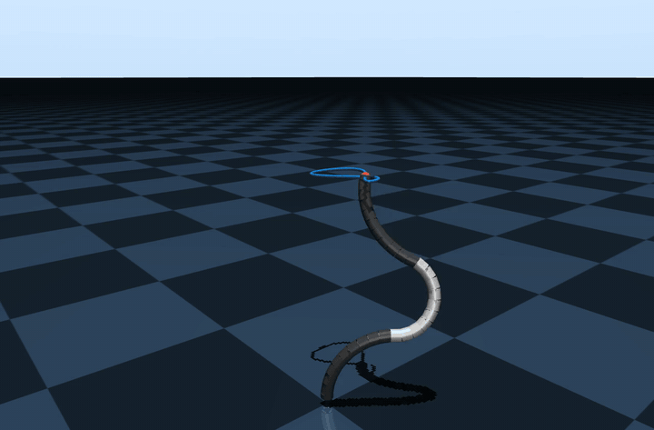
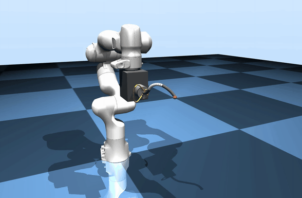
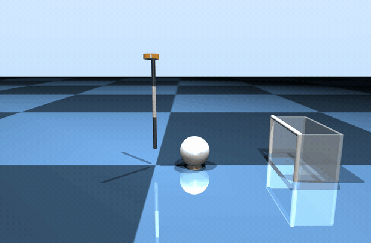

# OpenCR-MuJoCo

<p align="center">
  
  
  
</p>
<p align="center"><sub>
Closed-loop figure-8 tip tracing&nbsp;&nbsp;·&nbsp;&nbsp;station-keeping
against arm motion&nbsp;&nbsp;·&nbsp;&nbsp;an elastic whip kick into the
goal — all from
<a href="examples/trace_tip_demo.py"><code>examples/trace_tip_demo.py</code></a>
(<a href="docs/media/tdcr_tip_trace.mp4">HQ</a>&nbsp;·&nbsp;<a href="docs/media/franka_tdcr_trace.mp4">HQ</a>&nbsp;·&nbsp;<a href="docs/media/kick_goal.mp4">HQ</a>)
</sub></p>

Native [MuJoCo](https://mujoco.org) simulation of **tendon-driven continuum
robots (TDCRs)** by discretizing the continuum backbone into a serial chain of
rigid links with elastic joints.

The backbone rod is split into `N` links bounded by half-links, joined by
hinge pairs (or triples, adding torsion) whose stiffness comes from beam
theory (`N·EI/L` per joint, `G·J` for torsion), with tendons routed through
per-link sites and actuated natively by MuJoCo's tendon model. The approach is
validated against [SoRoSim](https://github.com/SoRoSim/SoRoSim)
Cosserat-rod solutions (statics and dynamics) and supports system
identification against hardware motion-capture data.

## Features

- **Unified TDCR generator** — single config-driven generator for 1–5 segment
  TDCRs with 3–4+ tendons per segment, material-based (Young's modulus) or
  direct stiffness, coupled / independent / tension tendon routing, pretension
  keyframes, and collision exclusions
- **Modular (heterogeneous) TDCRs** — compose robots from reusable modules
  with independent materials and geometry (e.g. stiff base, soft tip)
- **Evaluation framework** — statics and tip-release dynamics compared against
  bundled SoRoSim reference data, with arc-length-correct shape errors and
  publication-quality figures
- **Teleoperation** — keyboard and PlayStation DualSense control of the TDCR,
  a Franka Panda arm, or both combined (joint-space, task-space IK, and
  multi-point task-space modes)
- **System identification** — 3-step pipeline (geometry → tendon parameters →
  refinement) calibrating simulation parameters against hardware mocap data
  (bundled for two hardware TDCRs)
- **Hardware bridge** — optional Dynamixel bridge mirroring teleop commands to
  a real TDCR

## Installation

```bash
git clone https://github.com/ContinuumRoboticsLab/opencr-mujoco.git
cd opencr-mujoco

python -m venv .venv
source .venv/bin/activate          # Windows: .venv\Scripts\activate

pip install -r requirements.txt
pip install -e .                   # editable install
pip install -e ".[dev]"            # + pytest/black/flake8
pip install -e ".[hardware]"       # + Dynamixel SDK (real-robot bridge)
```

Requires Python 3.10+ and MuJoCo ≥ 3.0 (installed automatically from pip).

## Quick Start

> **macOS:** run the GUI commands below (`teleop.py`, `viewer.py`, and the live
> demo) with `mjpython` instead of `python` — MuJoCo's passive viewer requires
> it. Plain `python` is fine for `--list-configs`, `--headless`, and `--record`.

```bash
# Drive a TDCR (hold LSHIFT, then T/F/G/H to bend, Z/X/C to switch segment).
# Scene XMLs are generated automatically on first use — no setup step.
python teleop.py --config tdcr_keyboard

# ...or watch the gallery demos live (--record <name> re-renders the clips)
python examples/trace_tip_demo.py --demo kick

# Look at any model in the passive viewer
python viewer.py --scene assets/tdcr/example_three_segment_franka.xml

# Reproduce the validation against SoRoSim
python paper_results/evaluate.py --config spring_steel_statics --n-values 50 --early-stop 20
```

## Documentation

Every script documents itself — start with `--help` and the usage block at
the top of the file. The scripts share a JSON config system with precedence
**CLI args > config file > built-in defaults**; all expose `--list-configs`
and `--config NAME`, and `viewer.py`/`teleop.py` additionally support
`--show-config` and `--save-config NAME`.

| Topic | Start here |
|---|---|
| Model generation & config options | [`generate.py`](generate.py) · [configs/generation/README.md](configs/generation/README.md) |
| Teleoperation, keyboard/DualSense controls | [`teleop.py`](teleop.py) (control tables in the docstring) |
| Scene viewer | [`viewer.py`](viewer.py) |
| Demos (the GIFs above) | [`examples/trace_tip_demo.py`](examples/trace_tip_demo.py) |
| SoRoSim validation & paper figures | [paper_results/README.md](paper_results/README.md) |
| System identification | [opencr_mujoco/sysid/README.md](opencr_mujoco/sysid/README.md) |
| Controllers & Clark-coordinate control | [opencr_mujoco/controllers/README.md](opencr_mujoco/controllers/README.md) |
| Bundled reference / mocap data formats | [data/reference/sorosim/README.md](data/reference/sorosim/README.md) |
| Tests & development tooling | [tests/README.md](tests/README.md) — `python run_tests.py` |

## Development

Install the development extra before working on the code:

```bash
pip install -e ".[dev]"
```

Useful checks:

```bash
black .
flake8 . --count --statistics
python run_tests.py --quick
pytest tests/unit -q
```

The browser demo is generated from the same Python sources used by the desktop
tools. Rebuild and serve it locally with:

```bash
python docs/build_site.py
python docs/serve.py 8000
```

Generated TDCR scene XMLs under `assets/tdcr/` are intentionally not tracked;
the command-line tools regenerate them from `configs/generation/` on first use.
The small web-demo scene copies under `docs/scenes/` are tracked so GitHub
Pages can serve the browser simulator. Large policy-rollout videos are hosted
as GitHub Release assets and should not be committed.

## Contributing

`opencr-mujoco` is an open academic project, and we welcome contributions from
the community, including:

- Pull requests for new features, bug fixes, examples, or documentation.
- Bug reports through GitHub Issues.
- Suggestions that make the simulator easier to install, reproduce, or extend.
- New CR configurations, validation cases, or controller/evaluation tests.

See our [contribution guide](.github/CONTRIBUTING.md) for development setup,
testing, and repository hygiene notes.

## License

MIT License — see [LICENSE](LICENSE). The bundled Franka Panda meshes under
`assets/franka_assets/` are from franka_ros (Apache 2.0 — see
`assets/franka_assets/LICENSE.md`).

## Acknowledgments

- Franka robot assets from franka_ros
- SoRoSim reference data generated with
  [SoRoSim](https://github.com/SoRoSim/SoRoSim)
